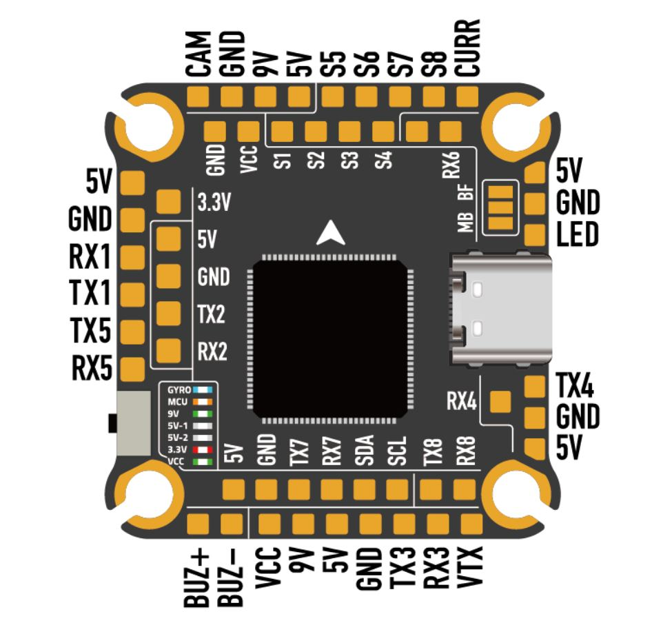

# MambaH743v4 Flight Controller

The MambaH743v4 is a flight controller produced by [Diatone](https://www.diatoneusa.com/).

## Features

 - MCU - STM32H743 32-bit processor running at 480 MHz
 - IMU - Dual MPU6000 (Version A) or BMI270 (Version B)
 - Barometer - DPS280
 - OSD - AT7456E
 - Onboard Flash: 1GBit
 - 8x UARTs
 - 9x PWM Outputs (8 Motor Output, 1 LED)
 - Battery input voltage: 2S-6S
 - BEC 3.3V 0.5A
 - BEC 5V 3A
 - BEC 5V 3A
 - BEC 9V 3A

## Pinout

## UART Mapping

The UARTs are marked Rn and Tn in the above pinouts. The Rn pin is the
receive pin for UARTn. The Tn pin is the transmit pin for UARTn.

 - SERIAL0 -> USB
 - SERIAL1 -> UART1 (RX/SBUS, DMA-enabled)
 - SERIAL2 -> UART2
 - SERIAL3 -> UART3
 - SERIAL4 -> UART4 (GPS, DMA-enabled)
 - SERIAL5 -> UART5 (SPort)
 - SERIAL6 -> UART6 (ESC Telemetry)
 - SERIAL7 -> UART7 (GPS, DMA-enabled)

## RC Input

RC input is configured on the R1 (UART1_RX) pin. It supports all serial RC
protocols. For protocols requiring half-duplex serial to transmit
telemetry (such as FPort) you should setup SERIAL6 as an RC input serial port,
with half-duplex, pin-swap and inversion enabled.
 
## FrSky Telemetry
 
FrSky Telemetry is supported using the T5 pin (UART5 transmit). You need to set the following parameters to enable support for FrSky S.PORT
 
  - SERIAL5_PROTOCOL 10
  - SERIAL5_OPTIONS 7
  
## OSD Support

The MambaH743v4 supports OSD using OSD_TYPE 1 (MAX7456 driver).

## PWM Output

The MambaH743v4 supports up to 9 PWM outputs. The pads for motor output
M1 to M8 are provided on both the motor connectors and on separate pads, plus
M9 on a separate pad for LED strip or another PWM output.

The PWM is in 4 groups:

 - PWM 1-4 in group1
 - PWM 5,6 in group2
 - PWM 7,8 in group3
 - PWM 9   in group4

Channels within the same group need to use the same output rate. If
any channel in a group uses DShot then all channels in the group need
to use DShot. Channels 1-8 support bi-directional dshot.

## Battery Monitoring

The board has a builting voltage and current sensor. The current
sensor can read up to 130 Amps. The voltage sensor can handle up to 6S
LiPo batteries.

The correct battery setting parameters are:

 - BATT_MONITOR 4
 - BATT_VOLT_PIN 11
 - BATT_CURR_PIN 13
 - BATT_VOLT_MULT 11.1
 - BATT_AMP_PERVLT 64

## Compass

The MambaH743v4 does not have a builtin compass, but you can attach an external compass using I2C on the SDA and SCL pads.

## Loading Firmware

Initial firmware load can be done with DFU by plugging in USB with the
bootloader button pressed. Then you should load the "with_bl.hex"
firmware, using your favourite DFU loading tool.

Once the initial firmware is loaded you can update the firmware using
any ArduPilot ground station software. Updates should be done with the
*.apj firmware files.

